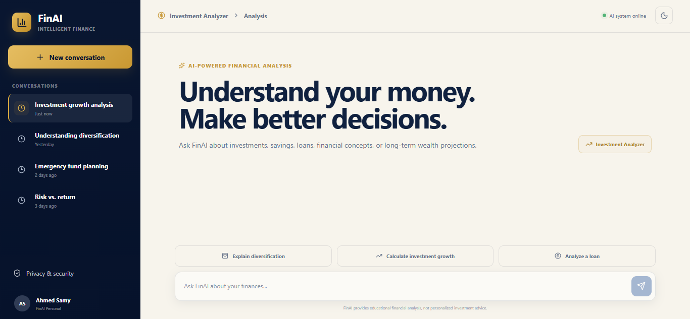
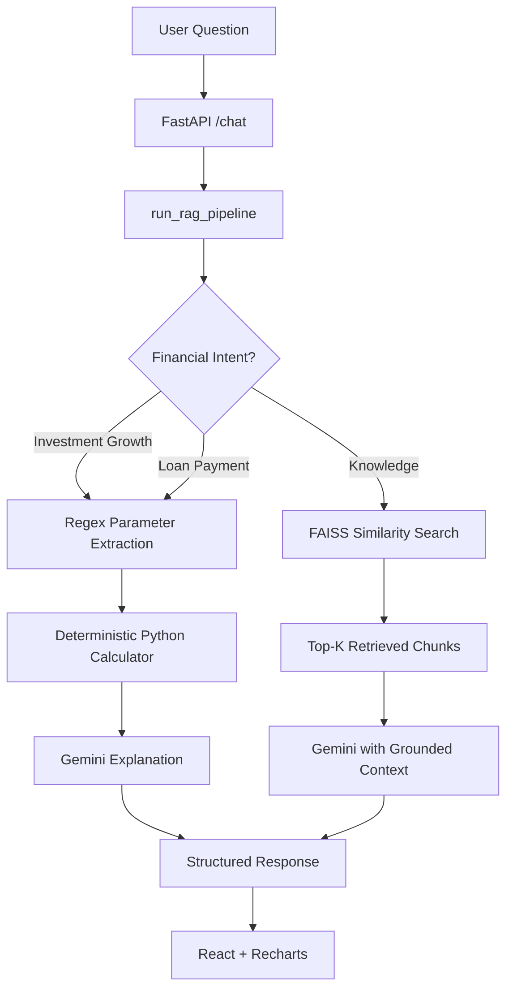
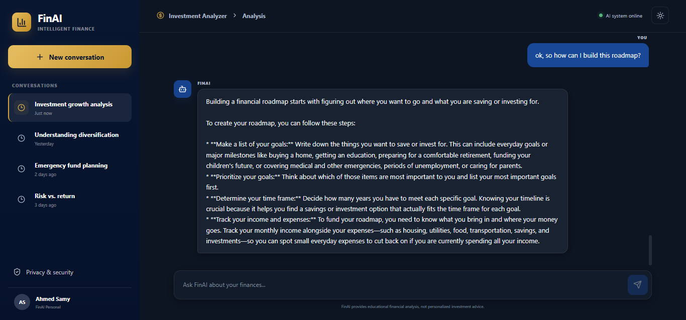
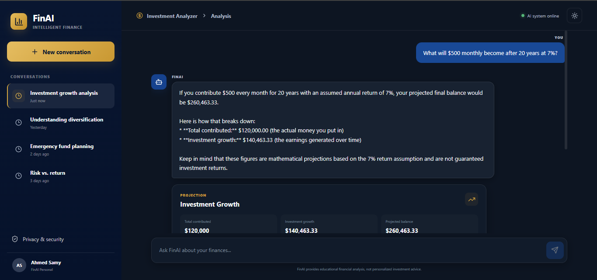
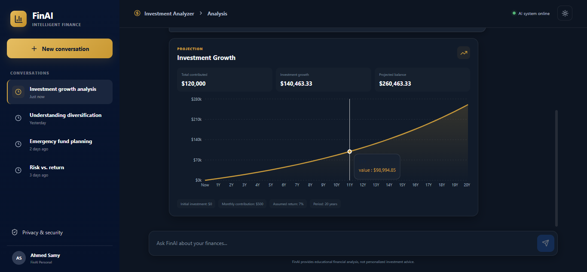
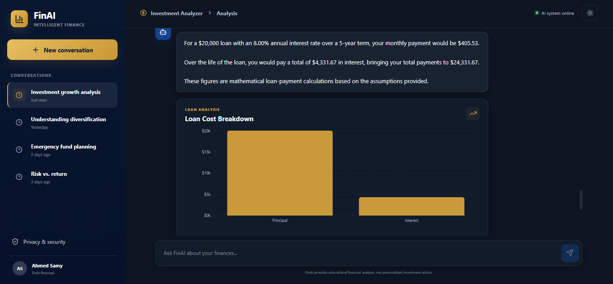
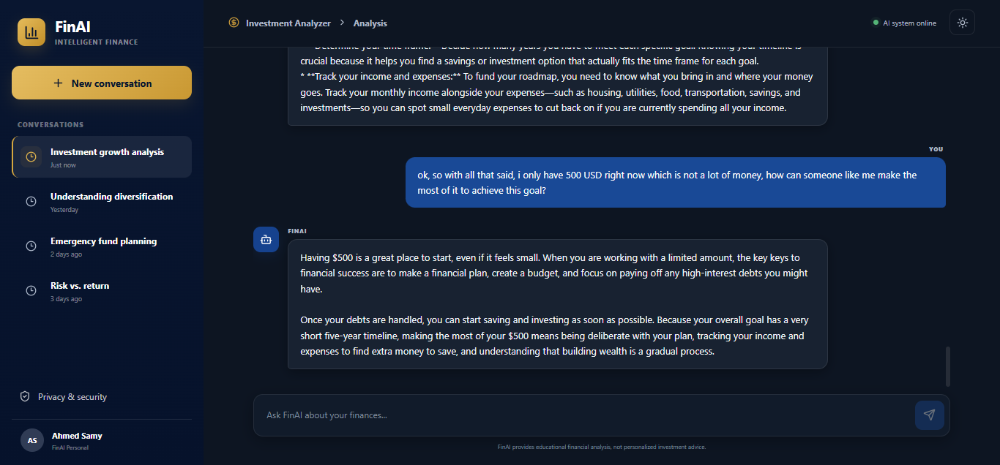

# FinAI

An AI-powered personal financial education assistant that combines Retrieval-Augmented Generation with deterministic financial calculation tools.

## Overview

FinAI is a full-stack application built to demonstrate practical AI/ML engineering: retrieval-augmented generation, embedding-based semantic search, LLM-driven natural-language explanation, and deterministic financial computation, all wired together into a working chat interface.

Rather than treating the project as "just a RAG chatbot," FinAI is better described as a **hybrid financial education assistant**. It routes user questions down one of two distinct processing paths:

1. **Financial calculation path** — rule-based intent detection and regex-based parameter extraction feed a deterministic Python calculator, whose numeric output is explained in natural language by an LLM.
2. **RAG knowledge path** — user questions are answered using content retrieved from a curated knowledge base of financial education documents via FAISS similarity search.

The backend is built with **FastAPI/Python**; the frontend is built with **React, Vite, and TypeScript**, with financial results visualized using **Recharts**.

FinAI is designed to help users understand core financial concepts — saving, investing, budgeting, emergency funds, diversification, compound interest, and risk — while also producing concrete, reproducible numbers for investment growth projections and loan payments.

## Demo


*The main chat interface, showing the conversational layout used for both educational questions and financial calculations.*

## Key Features

- **Hybrid architecture** combining retrieval-augmented generation with deterministic financial calculators
- **Rule-based financial intent detection** to distinguish calculation requests from general knowledge questions
- **Regex-based parameter extraction** for investment and loan calculation inputs
- **Deterministic financial calculators** for investment growth projections and loan payments — the arithmetic is never delegated to the LLM
- **Embedding-based semantic retrieval** over a curated set of financial education PDFs using FAISS
- **Gemini-powered natural-language generation**, grounded in either retrieved context or calculator output
- **Short-term conversation memory** for context-aware follow-up questions
- **Interactive financial visualizations** (area and bar charts) rendered with Recharts
- **Structured API responses** that carry answer text alongside calculation results and chart-ready data

## How It Works

Every user question passes through a single orchestration pipeline that decides how it should be handled:

1. The question is checked against **rule-based financial intent detection** (investment growth, loan payment, or general knowledge).
2. If a calculation intent is detected, parameters are extracted with regex and passed to a deterministic Python calculator. The numeric result is then explained by Gemini.
3. If no calculation intent is detected, the question is treated as a knowledge query: relevant chunks are retrieved from a FAISS vector store built from financial education PDFs, and Gemini generates an answer grounded in that retrieved context.
4. In both cases, the exchange is appended to a short-term, in-memory conversation history, and a structured response is returned to the frontend.

An important architectural distinction: **FinAI does not ask Gemini to perform financial arithmetic.** For supported calculations, Python computes the numbers deterministically, and Gemini's role is limited to explaining those numbers in natural language.

## System Architecture



## RAG Pipeline

### Knowledge Base

The retrieval knowledge base is built from five financial education PDFs:

| Document | Source | Role |
|---|---|---|
| Saving and Investing — A Roadmap to Your Financial Security | Investor.gov | Core personal finance and investing education |
| Saving and Investing for Students | Investor.gov | Accessible financial fundamentals |
| Teacher Investing Guide | Investor.gov | Debt, credit, saving, investing, retirement |
| Saving for Financial Shocks and Emergencies | Consumer Financial Protection Bureau (CFPB) | Emergency funds and financial resilience |
| A Guide for Seniors — Learn Investing Basics | Investor.gov | Risk, diversification, asset allocation, investment products |


*An educational question answered using content grounded in the retrieved knowledge base.*

### Ingestion

Implemented in `backend/scripts/ingest.py`.


- PDFs are loaded page-by-page with `PyPDFLoader`, with each page tagged with its source filename and a 1-based page number.
- Text is split using `RecursiveCharacterTextSplitter` with `chunk_size=800` and `chunk_overlap=150`, using separators `["\n\n", "\n", ". ", " ", ""]`. Note that `chunk_size=800` refers to the splitter's configured character-based chunk size, not a tokenizer-defined token count.
- Each chunk is assigned a `chunk_id`.
- Embeddings are generated using `sentence-transformers/all-MiniLM-L6-v2` on CPU, with `normalize_embeddings=True`.
- The resulting vectors are stored in a local **FAISS** index under `vectorstore/`.

### Retrieval

Implemented in `backend/app/rag/retriever.py`.

- Retrieval is **embedding-based semantic similarity search using FAISS**, not keyword search.
- The same `all-MiniLM-L6-v2` embedding model used at ingestion time is used to embed the incoming query.
- `similarity_search()` is used with a default `top_k = 4`.
- The embedding model and vector store are cached in module-level variables after the first load, avoiding repeated disk reads.

### Generation

Implemented in `backend/app/rag/generator.py`.

- LLM integration uses `ChatGoogleGenerativeAI` from `langchain-google-genai`.
- The model name is read from the `GEMINI_MODEL` environment variable, defaulting to `gemini-3.5-flash-lite`.
- The API key is read from `GOOGLE_API_KEY`.
- The system prompt establishes FinAI as an AI-powered personal financial education assistant and enforces RAG grounding: factual claims should be tied to retrieved context, the model should avoid fabricating financial facts, conflicting retrieved information should be acknowledged, and the assistant should present itself as educational rather than a licensed financial advisor — without repeating disclaimers on routine educational questions.
- The generator assembles the system prompt, recent conversation history, retrieved context or calculator output, and the current question before calling the model.

## Financial Calculation Engine


*A deterministic investment growth calculation, with the numeric result explained in natural language.*

### Intent Detection

Implemented in `backend/app/core/financial_tools.py`.

Intent detection is **rule-based**, using keyword/phrase matching, regular expressions, and the presence of numerical information — it does not use an LLM classifier. Supported intents:

- `investment_growth` — triggered by phrases such as "calculate," "how much will I have," "future value," or "investment growth"
- `loan_payment` — triggered by phrases such as "loan," "mortgage payment," "car loan," "monthly payment," or "repayment"
- `knowledge` — the fallback path when no calculation rule matches, handled by the RAG pipeline

### Parameter Extraction

Extraction is **regex-based**, not LLM-based.

| Calculation | Parameters |
|---|---|
| Investment growth | `initial_investment` (optional, defaults to `0.0`), `monthly_contribution`, `annual_return`, `years` |
| Loan payment | `loan_amount`, `annual_interest_rate`, `years` (loan terms given in months are converted to years) |

If a required parameter is missing, the system returns a `missing_parameters` response rather than guessing at a value.

### Investment Growth Calculator

Implemented in `backend/app/core/financial_calculators.py` as `calculate_investment_growth()`.

Assumptions: contributions occur at the end of each month, the annual return is converted to a monthly rate, and compounding occurs monthly.

```
monthly_rate = annual_return / 100 / 12
number_of_months = years * 12

initial_growth = initial_investment * (1 + monthly_rate) ** number_of_months
contribution_growth = monthly_contribution * (((1 + monthly_rate) ** number_of_months - 1) / monthly_rate)

final_balance = initial_growth + contribution_growth
investment_growth = final_balance - total_contributed
```

The zero-return case is handled separately. Inputs are validated: initial investment, monthly contribution, and annual return cannot be negative, and `years` must be greater than zero. The calculator returns `total_contributed`, `investment_growth`, and `final_balance`. These are mathematical projections based on the assumptions supplied by the user — not guaranteed returns.


*Investment growth over time rendered as an area chart on the frontend.*

### Loan Payment Calculator

Implemented in `backend/app/core/financial_calculators.py` as `calculate_loan_payment()`.

Assumptions: a fixed interest rate, monthly payments, standard amortization, and no additional fees or penalties. The standard amortizing loan formula is used for non-zero interest rates; for a zero interest rate, the loan amount is divided evenly across the number of monthly payments. Inputs are validated: `loan_amount` must be greater than zero, the interest rate cannot be negative, and the loan term must be greater than zero. The calculator returns `loan_amount`, `monthly_payment`, `total_paid`, and `total_interest`.


*A loan payment calculation, with cost breakdown visualized as a bar chart.*

## Conversation Memory

Implemented in `backend/app/core/memory.py`.

FinAI uses a simple **in-memory** conversation manager, keyed by `conversation_id`, storing a `Dict[str, List[dict]]` of `{role, content}` messages. Only the 10 most recent messages per conversation are retained, and history is held in a single global `conversation_memory` instance. This memory is **not persistent** — it is lost whenever the backend process restarts. It exists to support context-aware follow-up questions within a single running session, not long-term storage.


*A follow-up question answered using recent conversation history.*

## Technology Stack

| Layer | Technology |
|---|---|
| Frontend | React, TypeScript, Vite, Recharts |
| Backend | Python, FastAPI, Pydantic, Uvicorn |
| Document Loading | LangChain, PyPDFLoader |
| Text Splitting | RecursiveCharacterTextSplitter |
| Embeddings | Hugging Face sentence-transformers (`all-MiniLM-L6-v2`) |
| Vector Search | FAISS |
| LLM | Google Gemini via `langchain-google-genai` (`ChatGoogleGenerativeAI`) |

## Project Structure

```
FinAI/
│
├── .env
├── .env.example
├── .gitignore
├── package.json
├── package-lock.json
├── README.md
│
├── backend/
│   ├── requirements.txt
│   │
│   ├── app/
│   │   ├── main.py
│   │   │
│   │   ├── api/
│   │   │   └── chat.py
│   │   │
│   │   ├── core/
│   │   │   ├── financial_calculators.py
│   │   │   ├── financial_tools.py
│   │   │   └── memory.py
│   │   │
│   │   └── rag/
│   │       ├── generator.py
│   │       ├── pipeline.py
│   │       └── retriever.py
│   │
│   └── scripts/
│       ├── ingest.py
│       ├── test_financial_calculators.py
│       ├── test_financial_tools.py
│       ├── test_generator.py
│       ├── test_pipeline.py
│       └── test_retrieval.py
│
├── data/
│   └── raw/
│       └── *.pdf
│
├── frontend/
│   ├── package.json
│   ├── package-lock.json
│   ├── vite.config.ts
│   └── src/
│       ├── App.tsx
│       ├── App.css
│       ├── index.css
│       └── main.tsx
│
├── docs/
│   ├── interface.png
│   ├── financial_advice.png
│   ├── context_aware_conversation.png
│   ├── investment_analysis.png
│   ├── investment_projection.png
│   └── loan_analysis.png
│
└── vectorstore/          # generated locally, ignored by Git
    ├── index.faiss
    └── index.pkl
```

> **Note:** `vectorstore/` is excluded from version control via `.gitignore`. It is generated locally by running the ingestion script and is not committed to the repository.

## Getting Started

### Prerequisites

- Python 3.10+
- Node.js and npm
- A Google Gemini API key (`GOOGLE_API_KEY`)

### Installation

1. **Clone the repository**

   ```bash
   git clone https://github.com/Ahmedsamy2003/FinAI.git
   cd FinAI
   ```

2. **Create and activate a Python virtual environment**

   ```bash
   python -m venv .venv
   ```

   On Windows:

   ```bash
   .venv\Scripts\activate
   ```

   On macOS/Linux:

   ```bash
   source .venv/bin/activate
   ```

3. **Install backend dependencies**

   ```bash
   pip install -r backend/requirements.txt
   ```

4. **Install frontend dependencies**

   ```bash
   cd frontend
   npm install
   cd ..
   ```

### Environment Variables

Create a `.env` file in the project root (a `.env.example` template is provided). Do not commit `.env` to version control.

```
GOOGLE_API_KEY=your_google_api_key_here
GEMINI_MODEL=gemini-3.5-flash-lite
```

- `GOOGLE_API_KEY` — required; used to authenticate with the Gemini API.
- `GEMINI_MODEL` — optional; defaults to `gemini-3.5-flash-lite` if not set.

### Knowledge Base Setup

Place the source financial education PDFs under `data/raw/`.

### Build the Vector Store

Because `vectorstore/` is not committed to the repository, run the ingestion script after cloning to build it locally:

```bash
python backend/scripts/ingest.py
```

This loads the PDFs, splits them into chunks, generates embeddings, and writes a local FAISS index to `vectorstore/`. This step must be completed before the knowledge-based (RAG) path will return meaningful answers.

### Run the Backend

```bash
uvicorn backend.app.main:app --reload
```

The API will be available at `http://127.0.0.1:8000`.

### Run the Frontend

```bash
cd frontend
npm run dev
```

The frontend dev server runs at `http://localhost:5173` and is configured (via CORS on the backend) to communicate with the FastAPI server.

## API Reference

### `GET /health`

Health check endpoint.

**Response**

```json
{
  "status": "ok",
  "service": "FinAI API"
}
```

### `POST /chat`

The active chat endpoint, defined in `backend/app/main.py`.

**Request**

```json
{
  "question": "What is diversification?",
  "conversation_id": "default",
  "top_k": 4
}
```

**Response**

```json
{
  "answer": "string",
  "type": "string",
  "intent": "optional string",
  "parameters": "optional object",
  "result": "optional object",
  "chart": "optional object",
  "analysis": "optional object"
}
```

For knowledge-path responses, `intent`, `parameters`, `result`, `chart`, and `analysis` are typically empty. For calculation-path responses, these fields carry the detected intent, extracted parameters, the deterministic calculation result, and chart-ready data for the frontend.

The endpoint strips and validates the incoming question (returning HTTP 400 for empty input), invokes the RAG/calculation pipeline, and returns HTTP 500 on unexpected exceptions.

> **Note:** `backend/app/api/chat.py` defines an additional `APIRouter` with `prefix="/api"` and a `POST /api/chat` route. This router is not currently mounted via `app.include_router()` in `main.py` and is not part of the active API surface — treat it as an alternate/legacy implementation rather than a live endpoint.

## Example Queries

**Knowledge questions:**

- "What is compound interest?"
- "What is diversification?"
- "What is an emergency fund?"
- "What financial risks should I consider before relying on an investment projection?"

**Calculation questions:**

- "I have $5,000 to invest and can contribute $500 per month for 10 years at a 7% annual return. What would my projected balance be?"
- "How much would I pay each month on a $20,000 loan at 6% interest over 5 years?"

Calculation outputs are mathematical projections based on the assumptions supplied in the question — they are not guaranteed investment returns.

## Testing

The project includes the following test scripts under `backend/scripts/`:

- `test_financial_calculators.py`
- `test_financial_tools.py`
- `test_generator.py`
- `test_pipeline.py`
- `test_retrieval.py`

These scripts cover the deterministic calculators, intent/parameter extraction, generation, pipeline orchestration, and retrieval components individually.

## Design Decisions

- **Why FAISS:** provides local vector similarity retrieval with straightforward integration, without requiring an external vector database service.
- **Why `all-MiniLM-L6-v2`:** a lightweight sentence-transformer model well suited to local embedding generation without heavy compute requirements.
- **Why deterministic calculators:** financial arithmetic should be reproducible and controlled rather than left entirely to an LLM, which is why Python — not Gemini — performs the actual calculations.
- **Why rule-based intent detection:** a simple, transparent routing mechanism for the currently supported calculation intents, easy to reason about and extend.
- **Why RAG grounding:** reduces unsupported financial claims by tying educational answers to a curated knowledge base rather than the model's unconstrained output.
- **Why conversation memory:** allows natural follow-up questions within a single conversation session.

These are design choices made for this implementation, not claims of universally optimal architecture.

## Limitations

- Knowledge coverage is limited to the curated PDF corpus; questions outside that scope may not be answered well.
- Intent detection is rule-based and limited to the language patterns it currently recognizes.
- Parameter extraction relies on regex and can fail with unexpected phrasing.
- Conversation memory is in-memory only and is lost when the backend process restarts.
- Investment projections depend entirely on user-supplied assumptions; returns are not guaranteed.
- The loan calculator assumes a fixed-rate, standard amortizing loan and excludes additional fees or penalties.
- The system is built for financial education, not individualized professional financial advice.
- The local FAISS vector store must be generated from source PDFs after cloning; it is not distributed with the repository.
- This is a development-oriented project and should not be described as production-ready.

## Security and Configuration

- API credentials (`GOOGLE_API_KEY`) belong in a local `.env` file, which is excluded from version control.
- `.env.example` is committed as a template and contains no real credentials.
- Generated artifacts under `vectorstore/`, along with `node_modules/`, Python virtual environments, `__pycache__/`, `.pytest_cache/`, logs, IDE files, and OS files, are excluded from version control via `.gitignore`.

## Safety and Financial Education

FinAI is an educational assistant. It can explain financial concepts and produce mathematical projections based on assumptions the user provides. It does not guarantee returns, present investments as risk-free, assume complete knowledge of a user's financial situation, or present personalized investment decisions as professional financial advice.

## Future Improvements

The following are potential directions for future work and are **not currently implemented**:

- Improved, more flexible intent classification
- More robust parameter extraction beyond regex patterns
- Persistent conversation storage
- Broader financial knowledge base coverage
- Additional financial calculators
- Improved retrieval, including reranking
- Deployment infrastructure
- Authentication
- An evaluation framework for answer quality
- Richer financial visualizations

## License

This project is licensed under the [MIT License](LICENSE).